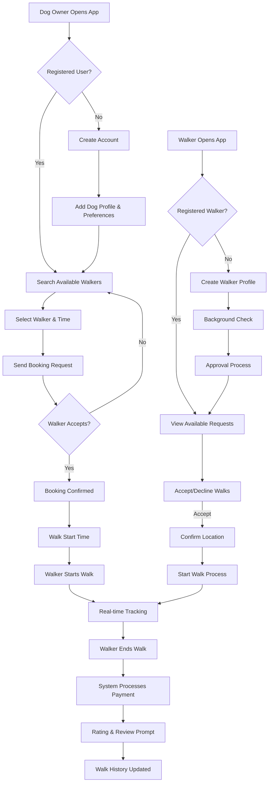
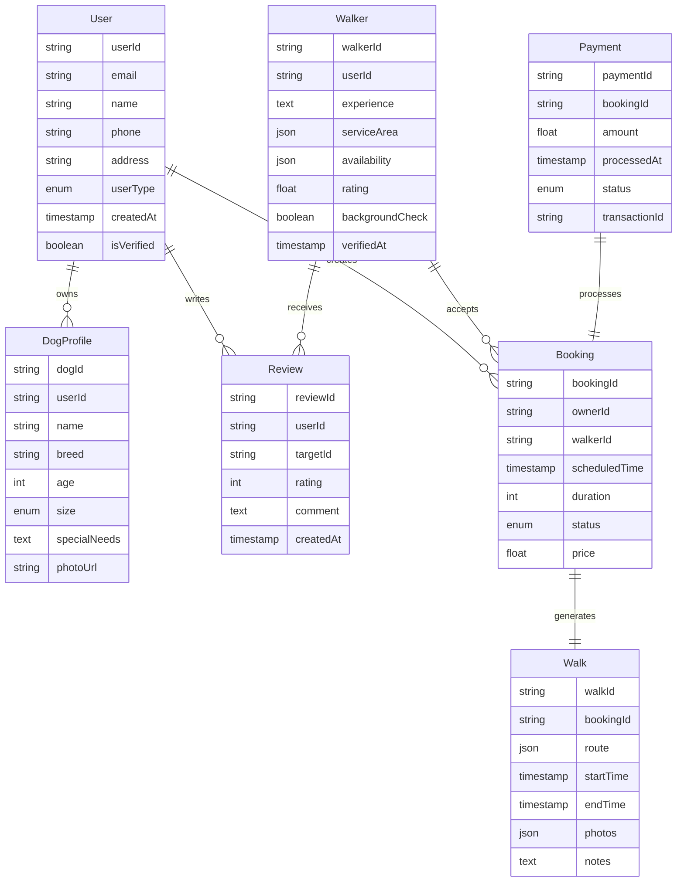
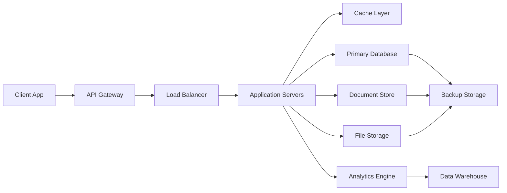

# 1. Introduction

## 1.1 Purpose
This Software Requirements Specification (SRS) document provides a comprehensive description of the Dog Walker Booking mobile application. It details the functional and non-functional requirements for development teams, project stakeholders, and quality assurance teams to ensure aligned understanding and successful implementation of the system.

## 1.2 Scope
The Dog Walker Booking application is a mobile platform connecting dog owners with local dog walkers through real-time booking and tracking capabilities. The system will:

- Facilitate on-demand dog walking service bookings
- Enable location-based walker discovery and matching
- Process secure financial transactions
- Provide real-time walk tracking and monitoring
- Support two-way rating and review systems
- Manage walker verification and background checks

Key benefits include:
- Convenient, flexible dog walking services for busy pet owners
- Income opportunities for verified dog walkers
- Transparent and secure payment processing
- Enhanced safety through real-time tracking and verification
- Quality assurance through mutual rating system

The application will be available on both iOS and Android platforms, utilizing GPS technology, secure payment gateways, and real-time messaging capabilities to deliver its core functionalities.

# 2. Product Description

## 2.1 Product Perspective
The Dog Walker Booking application operates as a standalone mobile platform while integrating with several external systems:

- Payment processing gateways for financial transactions
- GPS and mapping services for location tracking
- Push notification services for real-time alerts
- Cloud storage for user data and media
- Background check verification services
- Mobile device hardware (camera, GPS, notifications)

## 2.2 Product Functions
The system provides the following core functions:

- User Registration and Profile Management
  - Dog owner profiles with pet information
  - Walker profiles with credentials and availability
  - Identity verification and background checks

- Booking Management
  - Location-based walker search
  - Real-time availability checking
  - Scheduling and booking confirmation
  - Walk history tracking

- Walk Execution
  - Real-time GPS tracking
  - Route mapping and recording
  - Photo and status updates
  - Emergency contact system

- Payment Processing
  - Secure payment handling
  - Automated billing after walks
  - Transaction history
  - Refund management

- Quality Assurance
  - Two-way rating system
  - Review management
  - Dispute resolution
  - Service quality monitoring

## 2.3 User Characteristics

### Dog Owners
- Primary age range: 25-55 years
- Tech-savvy urban professionals
- Limited time for pet care
- Values convenience and reliability
- Moderate to high disposable income
- Basic mobile app proficiency required

### Dog Walkers
- Primary age range: 18-45 years
- Pet care experience preferred
- Flexible schedule availability
- Physically active individuals
- Basic mobile app proficiency required
- Must pass background checks

## 2.4 Constraints

### Technical Constraints
- Must support iOS 13+ and Android 8.0+
- Requires continuous internet connectivity
- Limited offline functionality
- Device must support GPS capabilities
- Maximum file size for profile images: 5MB

### Business Constraints
- Background check processing time: 2-5 business days
- Payment processing fees
- Insurance requirements for walkers
- Local business regulations compliance
- Maximum service radius: 25 miles

### Security Constraints
- GDPR and data privacy compliance
- Secure payment processing standards
- User data encryption requirements
- Regular security audits
- Two-factor authentication for walkers

## 2.5 Assumptions and Dependencies

### Assumptions
- Users have smartphones with GPS capabilities
- Stable internet connectivity in service areas
- Users have valid payment methods
- Walkers have reliable transportation
- Sufficient walker coverage in launch areas

### Dependencies
- Third-party payment gateway availability
- GPS service reliability
- Background check service availability
- Push notification service uptime
- Cloud storage service availability
- Mobile app store approval processes
- Local regulatory compliance verification

# 3. Process Flowchart



# 4. Functional Requirements

## 4.1 User Management

| ID | Description | Priority |
|---|---|---|
| F1.1 | System shall allow dog owners to create accounts with email or social media authentication | High |
| F1.2 | System shall enable dog owners to create profiles for multiple dogs with details including size, breed, age, and special needs | High |
| F1.3 | System shall allow walkers to create profiles with experience, availability, and service area | High |
| F1.4 | System shall facilitate walker background check verification process | Critical |
| F1.5 | System shall support two-factor authentication for walker accounts | High |

## 4.2 Booking System

| ID | Description | Priority |
|---|---|---|
| F2.1 | System shall display available walkers based on location, time, and service radius | Critical |
| F2.2 | System shall enable real-time booking requests with minimum 1-hour notice | High |
| F2.3 | System shall enforce maximum 3 dogs per walker rule | Medium |
| F2.4 | System shall allow walkers to accept or decline booking requests within 10 minutes | High |
| F2.5 | System shall send booking confirmations via push notifications and email | Medium |

## 4.3 Walk Execution

| ID | Description | Priority |
|---|---|---|
| F3.1 | System shall provide real-time GPS tracking of walk route | Critical |
| F3.2 | System shall allow walkers to send photo updates during walks | Medium |
| F3.3 | System shall record walk start and end times automatically | High |
| F3.4 | System shall provide emergency alert button with direct contact to support | High |
| F3.5 | System shall generate walk summary reports with route map and duration | Medium |

## 4.4 Payment Processing

| ID | Description | Priority |
|---|---|---|
| F4.1 | System shall process automatic payments upon walk completion | Critical |
| F4.2 | System shall support multiple payment methods (credit card, digital wallets) | High |
| F4.3 | System shall generate detailed receipts for all transactions | Medium |
| F4.4 | System shall handle refund requests through support interface | Medium |
| F4.5 | System shall maintain transaction history for users and walkers | Medium |

## 4.5 Rating and Review

| ID | Description | Priority |
|---|---|---|
| F5.1 | System shall prompt both parties for ratings after walk completion | High |
| F5.2 | System shall allow users to leave detailed reviews with character limit | Medium |
| F5.3 | System shall calculate and display average walker ratings | Medium |
| F5.4 | System shall allow reporting of inappropriate reviews | Low |
| F5.5 | System shall maintain review history for quality assurance | Medium |

## 4.6 Communication

| ID | Description | Priority |
|---|---|---|
| F6.1 | System shall provide in-app messaging between owners and walkers | High |
| F6.2 | System shall send push notifications for booking updates | High |
| F6.3 | System shall allow users to set notification preferences | Medium |
| F6.4 | System shall maintain message history for support purposes | Medium |
| F6.5 | System shall provide automated booking reminder notifications | Low |

# 5. Non-Functional Requirements

## 5.1 Performance Requirements

| ID | Requirement | Target Metric |
|---|---|---|
| P1.1 | Application launch time | ≤ 3 seconds |
| P1.2 | Location data refresh rate | Every 10 seconds during active walks |
| P1.3 | Map rendering response time | ≤ 2 seconds |
| P1.4 | Payment processing time | ≤ 5 seconds |
| P1.5 | Push notification delivery | ≤ 1 second |
| P1.6 | Maximum concurrent users | 100,000 |
| P1.7 | Database query response time | ≤ 500ms |
| P1.8 | Battery consumption | ≤ 10% per hour during active tracking |

## 5.2 Safety Requirements

| ID | Requirement | Description |
|---|---|---|
| S1.1 | Data Backup | Automated daily backups with 30-day retention |
| S1.2 | Fault Tolerance | System maintains core functions during partial outages |
| S1.3 | Emergency Contact | 24/7 emergency support hotline availability |
| S1.4 | Incident Recovery | Maximum 4-hour recovery time objective (RTO) |
| S1.5 | Geofencing Alerts | Automatic notifications if walker leaves designated area |

## 5.3 Security Requirements

| ID | Requirement | Description |
|---|---|---|
| SE1.1 | Authentication | Multi-factor authentication for walker accounts |
| SE1.2 | Data Encryption | AES-256 encryption for data at rest and in transit |
| SE1.3 | Session Management | Auto-logout after 30 minutes of inactivity |
| SE1.4 | Payment Security | PCI DSS compliance for payment processing |
| SE1.5 | Access Control | Role-based access control (RBAC) implementation |
| SE1.6 | Privacy | Data anonymization for analytics and reporting |

## 5.4 Quality Requirements

### 5.4.1 Availability
- System uptime: 99.9% excluding planned maintenance
- Maximum planned downtime: 4 hours per month
- Unplanned downtime resolution: ≤ 2 hours

### 5.4.2 Maintainability
- Modular architecture for easy updates
- Automated deployment processes
- Comprehensive system documentation
- Regular code reviews and testing

### 5.4.3 Usability
- Maximum 3 clicks to complete primary functions
- Intuitive UI with consistent design patterns
- Support for multiple languages
- Accessibility compliance with WCAG 2.1 Level AA

### 5.4.4 Scalability
- Horizontal scaling capability
- Support 50% annual user growth
- Auto-scaling based on demand
- Load balancing across multiple regions

### 5.4.5 Reliability
- Mean Time Between Failures (MTBF): ≥ 720 hours
- Mean Time To Recovery (MTTR): ≤ 1 hour
- Error rate: ≤ 0.1% of all transactions
- Data loss prevention with real-time replication

## 5.5 Compliance Requirements

| ID | Requirement | Description |
|---|---|---|
| C1.1 | Data Privacy | GDPR and CCPA compliance |
| C1.2 | Payment Standards | PCI DSS Level 1 compliance |
| C1.3 | Accessibility | ADA compliance for US operations |
| C1.4 | Location Services | Location data handling per local regulations |
| C1.5 | Worker Rights | Compliance with gig economy labor laws |
| C1.6 | Insurance | Digital proof of required insurance coverage |
| C1.7 | Audit Trails | Maintenance of complete audit logs for 7 years |

# 6. Data Requirements

## 6.1 Data Models



## 6.2 Data Storage

### 6.2.1 Storage Requirements
- Primary Database: PostgreSQL for structured relational data
- Document Store: MongoDB for flexible schema data (walk routes, photos)
- Cache Layer: Redis for session management and real-time data
- File Storage: AWS S3 for media files and documents

### 6.2.2 Data Retention
- User Profiles: Retained indefinitely while active
- Walk History: 7 years retention
- Chat Messages: 1 year retention
- Payment Records: 7 years retention
- System Logs: 90 days retention
- Temporary Files: 24 hours retention

### 6.2.3 Backup and Recovery
- Full database backup: Daily
- Incremental backups: Every 6 hours
- Point-in-time recovery capability: 30 days
- Backup retention period: 90 days
- Recovery Time Objective (RTO): 4 hours
- Recovery Point Objective (RPO): 1 hour

### 6.2.4 Data Redundancy
- Multi-region database replication
- Active-passive failover configuration
- Real-time synchronization between regions
- Minimum 3 copies of all critical data
- Geographic data distribution across availability zones

## 6.3 Data Processing



### 6.3.1 Data Security
- Encryption at rest: AES-256
- Encryption in transit: TLS 1.3
- Data masking for sensitive information
- Role-based access control (RBAC)
- Regular security audits
- Automated threat detection
- Data anonymization for analytics

### 6.3.2 Data Processing Requirements
- Real-time location data processing: 10-second intervals
- Payment processing: Synchronous with walk completion
- Analytics processing: Daily batch updates
- Image processing: Async with upload
- Background check processing: Within 24 hours
- Rating calculations: Real-time updates

### 6.3.3 Data Validation
- Input sanitization for all user data
- Schema validation for API requests
- Geocoding validation for addresses
- Image format and size validation
- Payment information verification
- Phone number and email verification

# 7. External Interfaces

## 7.1 User Interfaces

### 7.1.1 Mobile Application UI Requirements

| Screen | Key Elements | Requirements |
|---|---|---|
| Login/Registration | - Social login buttons<br>- Email/password fields<br>- User type selection | - Clean, minimalist design<br>- Maximum 2 screens for completion<br>- Clear validation feedback |
| Owner Dashboard | - Search bar<br>- Available walker map<br>- Active booking status<br>- Quick booking buttons | - Map takes 60% of screen space<br>- Pull-to-refresh functionality<br>- Bottom navigation bar |
| Walker Dashboard | - Available jobs list<br>- Earnings summary<br>- Schedule calendar<br>- Status toggle | - Card-based job listings<br>- Single-tap accept/decline<br>- Clear earnings metrics |
| Active Walk Screen | - Live map<br>- Timer<br>- Photo upload<br>- Emergency button | - Prominent emergency button<br>- Clear route visualization<br>- Battery-efficient display |
| Booking Flow | - Walker selection<br>- Time picker<br>- Dog selection<br>- Payment method | - Maximum 4 steps<br>- Progress indicator<br>- Clear pricing display |

### 7.1.2 Design Requirements
- Material Design 3 for Android
- iOS Human Interface Guidelines compliance
- Minimum touch target size: 44x44 points
- Maximum content width: 428 points
- Support for dark mode
- Responsive layout for different screen sizes

## 7.2 Hardware Interfaces

### 7.2.1 Mobile Device Requirements

| Component | Interface Requirements |
|---|---|
| GPS | - Minimum accuracy: 10 meters<br>- Update frequency: 10 seconds<br>- Background location access |
| Camera | - Minimum resolution: 5MP<br>- Auto-focus capability<br>- Flash control access |
| Network | - Support for 4G LTE and WiFi<br>- Automatic network switching<br>- Bandwidth optimization |
| Storage | - Minimum 100MB free space<br>- Cache management<br>- External storage access |
| Sensors | - Accelerometer for step counting<br>- Compass for orientation<br>- Proximity sensor support |

## 7.3 Software Interfaces

### 7.3.1 External Services Integration

| Service | Interface Type | Purpose |
|---|---|---|
| Payment Gateway | REST API | - Process payments<br>- Handle refunds<br>- Store payment methods |
| Maps Service | SDK | - Display maps<br>- Geocoding<br>- Route calculation |
| Push Notification | Firebase/APNs | - Real-time alerts<br>- Booking updates<br>- System notifications |
| Background Check | REST API | - Verify walker identity<br>- Process background checks<br>- Store verification status |
| Cloud Storage | S3 API | - Store user media<br>- Handle document uploads<br>- Manage profile pictures |

### 7.3.2 Database Interfaces
- PostgreSQL: TCP/IP connection, port 5432
- MongoDB: Standard connection string
- Redis: TCP connection, port 6379

## 7.4 Communication Interfaces

### 7.4.1 Network Protocols

| Protocol | Usage | Requirements |
|---|---|---|
| HTTPS | API Communication | - TLS 1.3<br>- Certificate pinning<br>- 256-bit encryption |
| WebSocket | Real-time Updates | - Secure WebSocket (WSS)<br>- Auto-reconnection<br>- Heartbeat monitoring |
| MQTT | Location Updates | - QoS Level 1<br>- Retained messages<br>- Topic-based filtering |

### 7.4.2 API Requirements
- RESTful architecture
- JSON data format
- Maximum payload size: 5MB
- Rate limiting: 100 requests/minute
- Compression: gzip
- Authentication: JWT tokens
- Response time: ≤ 200ms

### 7.4.3 Data Exchange Formats

```json
{
  "booking": {
    "id": "string",
    "timestamp": "ISO8601",
    "location": {
      "latitude": "float",
      "longitude": "float"
    },
    "status": "enum",
    "details": {
      "duration": "integer",
      "dogs": "array",
      "price": "float"
    }
  }
}
```

# 8. Appendices

## 8.1 Glossary

| Term | Definition |
|---|---|
| Background Check | Verification process required for all walkers including criminal record and identity verification |
| Geofencing | Virtual perimeter defined for a geographic area to trigger notifications when crossed |
| Rating System | Two-way evaluation mechanism allowing both owners and walkers to rate each other after service completion |
| Service Radius | Maximum distance (25 miles) a walker is willing to travel for dog walking services |
| Walk Route | GPS-tracked path recorded during an active dog walking session |
| Walker Verification | Multi-step process including background check, identity verification, and training completion |

## 8.2 Acronyms

| Acronym | Definition |
|---|---|
| ADA | Americans with Disabilities Act |
| API | Application Programming Interface |
| CCPA | California Consumer Privacy Act |
| GDPR | General Data Protection Regulation |
| GPS | Global Positioning System |
| JWT | JSON Web Token |
| MQTT | Message Queuing Telemetry Transport |
| PCI DSS | Payment Card Industry Data Security Standard |
| RBAC | Role-Based Access Control |
| REST | Representational State Transfer |
| RTO | Recovery Time Objective |
| RPO | Recovery Point Objective |
| SDK | Software Development Kit |
| TLS | Transport Layer Security |
| WCAG | Web Content Accessibility Guidelines |

## 8.3 Additional References

| Reference | Description | URL |
|---|---|---|
| Material Design 3 | Google's design system for Android | https://m3.material.io/ |
| iOS Human Interface Guidelines | Apple's design guidelines | https://developer.apple.com/design/human-interface-guidelines/ |
| OWASP Mobile Security Guide | Mobile security best practices | https://owasp.org/www-project-mobile-security/ |
| Firebase Documentation | Push notification implementation | https://firebase.google.com/docs |
| MongoDB Best Practices | Database optimization guidelines | https://www.mongodb.com/docs/manual/core/security-best-practices/ |
| AWS S3 Documentation | Cloud storage implementation | https://docs.aws.amazon.com/s3/ |