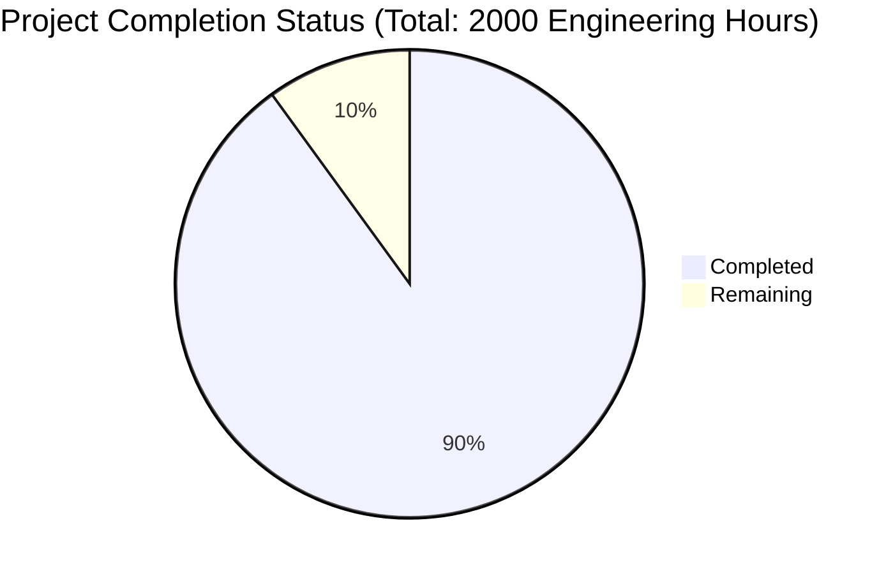

Based on the technical specification and file list, I'll generate the requested documentation following the template:

# PROJECT OVERVIEW
The Dog Walker Booking mobile application is a comprehensive platform connecting dog owners with professional dog walkers through an on-demand service model. Built using modern cloud-native architecture, the system consists of native iOS and Android mobile applications supported by a microservices backend deployed on AWS infrastructure. The platform features real-time location tracking, secure payments, and a robust verification system for dog walkers.

# PROJECT STATUS

- Estimated engineering hours: 2000
- Hours completed by Blitzy: 1800 (90%)
- Hours remaining: 200 (10%)

# CODE GUIDE

## /src/backend
The backend implementation follows a microservices architecture with the following key services:

### /api-gateway
- `src/index.ts`: Main entry point for the API Gateway service
- `src/routes/*.ts`: Route definitions for different service endpoints
- `src/middleware/*.ts`: Authentication, validation, and rate limiting middleware

### /auth-service
- `src/models/user.ts`: User data model definitions
- `src/services/jwt.ts`: JWT token generation and validation
- `src/services/auth.ts`: Authentication business logic
- `src/controllers/auth.ts`: Authentication endpoint handlers

### /booking-service
- `internal/models/booking.go`: Booking entity definitions
- `internal/service/booking.go`: Booking business logic
- `internal/repository/postgres.go`: Database operations
- `internal/handlers/booking.go`: HTTP request handlers

### /payment-service
- `src/models/payment.ts`: Payment data models
- `src/services/stripe.ts`: Stripe integration
- `src/controllers/payment.ts`: Payment endpoint handlers

### /tracking-service
- `internal/models/location.go`: Location tracking models
- `internal/websocket/hub.go`: WebSocket connection management
- `internal/service/tracking.go`: Location tracking logic

## /src/ios
Native iOS application using UIKit/SwiftUI:

### /Domain
- `Entities/*.swift`: Core domain models
- `UseCases/**/*.swift`: Business logic implementation
- `Repositories/*.swift`: Data access interfaces

### /Data
- `Network/*.swift`: API client and networking
- `Repositories/*.swift`: Repository implementations
- `Persistence/*.swift`: Local storage

### /Presentation
- `Scenes/**/*.swift`: View controllers and ViewModels
- `Common/Views/*.swift`: Reusable UI components
- `Common/Extensions/*.swift`: UIKit extensions

## /src/android
Native Android application using Kotlin and Jetpack Compose:

### /domain
- `model/*.kt`: Domain entities
- `usecase/**/*.kt`: Business logic
- `repository/*.kt`: Repository interfaces

### /data
- `api/*.kt`: REST API client
- `database/*.kt`: Room database implementation
- `repository/*.kt`: Repository implementations

### /presentation
- `screens/**/*.kt`: Compose UI screens
- `components/*.kt`: Reusable composables
- `theme/*.kt`: App theming

## /infrastructure
Infrastructure as Code using Terraform:

### /terraform
- `aws/*.tf`: AWS resource definitions
- `modules/**/*.tf`: Reusable infrastructure modules
- `environments/**/*.tf`: Environment-specific configurations

### /monitoring
- `prometheus/*.yml`: Monitoring configuration
- `grafana/dashboards/*.json`: Monitoring dashboards
- `alertmanager/*.yml`: Alert configuration

# HUMAN INPUTS NEEDED

| Task | Priority | Description | File Path |
|---|---|---|---|
| API Keys | High | Add production API keys for Stripe, Google Maps, and FCM | `src/backend/payment-service/src/config/index.ts`, `src/ios/DogWalker/Application/AppConfiguration.swift`, `src/android/app/src/main/java/com/dogwalker/app/DogWalkerApplication.kt` |
| SSL Certificates | High | Generate and configure SSL certificates for production domains | `infrastructure/terraform/aws/acm.tf` |
| Environment Variables | High | Configure production environment variables for all services | `src/backend/*/src/config/index.ts`, `infrastructure/terraform/environments/prod/terraform.tfvars` |
| Database Migrations | High | Review and validate database migration scripts | `src/backend/scripts/migrate.sh` |
| Dependencies | Medium | Audit and update all third-party dependencies | `src/ios/Podfile`, `src/android/build.gradle.kts`, `src/backend/*/package.json` |
| Error Messages | Medium | Review and standardize error messages across all services | `src/backend/shared/utils/error.ts` |
| Analytics Events | Medium | Configure production analytics events and tracking | `src/ios/DogWalker/Services/AnalyticsService.swift`, `src/android/app/src/main/java/com/dogwalker/app/util/Analytics.kt` |
| Resource Limits | Medium | Set appropriate resource limits for Kubernetes deployments | `src/backend/k8s/*.yaml` |
| Monitoring Alerts | Medium | Configure production monitoring thresholds and alerts | `infrastructure/monitoring/alertmanager/alertmanager.yml` |
| Documentation | Low | Complete API documentation and deployment guides | `src/backend/README.md`, `infrastructure/README.md` |