# 1. INTRODUCTION

## 1.1 Executive Summary

The Dog Walker Booking mobile application is a comprehensive platform designed to connect dog owners with professional dog walkers through an on-demand service model. This solution addresses the growing need for flexible pet care services in urban environments where pet owners face time constraints in providing regular exercise for their dogs. The platform serves two primary user groups: busy dog owners seeking reliable walking services and verified dog walkers looking to monetize their services.

The system will revolutionize the pet care industry by providing real-time booking capabilities, secure payment processing, and live walk tracking, while ensuring safety through comprehensive walker verification processes. This solution is expected to capture significant market share in the $1.5B dog walking industry by offering superior convenience, transparency, and trust compared to traditional service models.

## 1.2 System Overview

### Project Context

| Aspect | Description |
|---|---|
| Market Position | Premium, tech-enabled dog walking service platform |
| Target Market | Urban areas with high dog ownership and smartphone adoption |
| Competitive Advantage | Real-time booking, live tracking, verified walker network |
| Enterprise Integration | Standalone platform with third-party service integration |

### High-Level Description

| Component | Implementation |
|---|---|
| Mobile Applications | Native iOS and Android apps using platform-specific frameworks |
| Backend Services | Cloud-based microservices architecture |
| Real-time Features | WebSocket-based tracking and messaging |
| Data Management | Distributed database system with real-time synchronization |
| Security Layer | Multi-factor authentication and encrypted communications |

### Success Criteria

| Metric | Target |
|---|---|
| User Adoption | 10,000 active users within 6 months |
| Walker Network | 1,000 verified walkers in launch markets |
| Booking Conversion | 75% booking request acceptance rate |
| User Satisfaction | 4.5+ average rating on 5-point scale |
| Platform Uptime | 99.9% availability excluding maintenance |
| Response Time | 95% of requests completed within 200ms |

## 1.3 Scope

### In-Scope Elements

#### Core Features

| Category | Features |
|---|---|
| User Management | - User registration and profiles<br>- Dog profile management<br>- Walker verification system |
| Booking System | - Real-time availability search<br>- Booking management<br>- Schedule coordination |
| Service Execution | - Live GPS tracking<br>- Photo updates<br>- Route recording |
| Payments | - Secure payment processing<br>- Automated billing<br>- Receipt generation |
| Quality Assurance | - Rating system<br>- Review management<br>- Dispute resolution |

#### Implementation Boundaries

| Boundary Type | Coverage |
|---|---|
| Geographic | Major metropolitan areas in United States |
| User Types | Dog owners and verified dog walkers |
| Platforms | iOS 13+ and Android 8.0+ |
| Service Types | On-demand and scheduled dog walking |

### Out-of-Scope Elements

- Pet sitting and boarding services
- Pet transportation services
- Veterinary service integration
- Pet supply e-commerce
- Group walking coordination
- International markets
- Web-based booking platform
- Pet training services
- Insurance claim processing
- Automated walker matching algorithms
- Real-time video streaming
- Social network features

# 7. SYSTEM ARCHITECTURE

## 7.1 High-Level Architecture

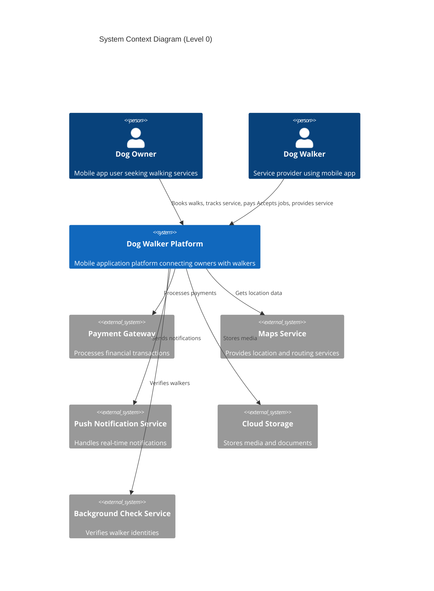

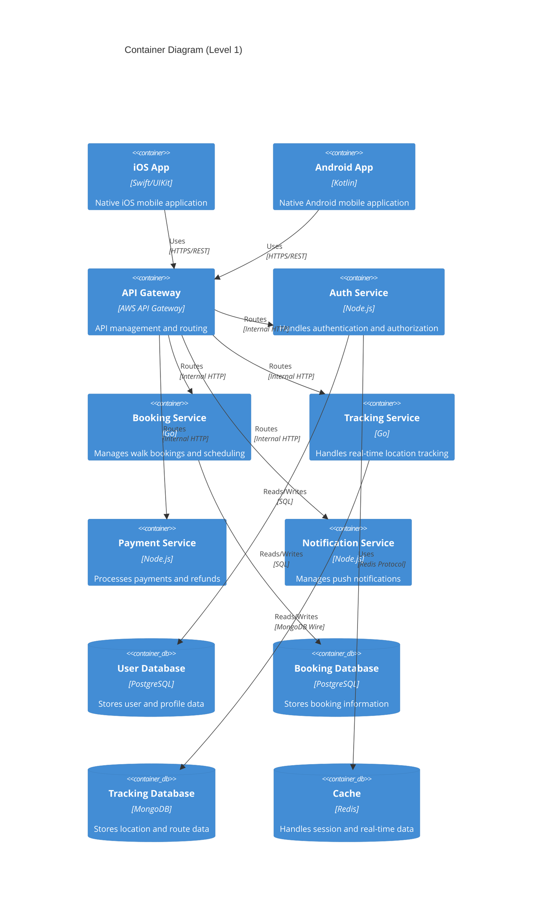

## 7.2 Component Details

### 7.2.1 Core Components

| Component | Technology | Purpose | Scaling Strategy |
|---|---|---|---|
| API Gateway | AWS API Gateway | Request routing, rate limiting | Horizontal auto-scaling |
| Auth Service | Node.js/Express | User authentication, JWT management | Horizontal scaling with session affinity |
| Booking Service | Go | Walk scheduling, availability management | Horizontal scaling with distributed locking |
| Tracking Service | Go | Real-time location processing | Horizontal scaling with sharding |
| Payment Service | Node.js/Express | Payment processing, financial records | Vertical scaling with redundancy |
| Notification Service | Node.js/Express | Push notification management | Horizontal scaling with queue-based processing |

### 7.2.2 Data Storage Components

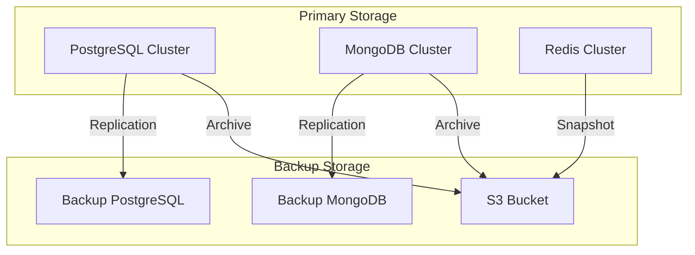

## 7.3 Technical Decisions

### 7.3.1 Architecture Patterns

| Pattern | Implementation | Justification |
|---|---|---|
| Microservices | Domain-based service separation | Enables independent scaling and deployment |
| Event-Driven | Apache Kafka for event streaming | Handles real-time updates and async processing |
| CQRS | Separate read/write models | Optimizes query and command performance |
| API Gateway | AWS API Gateway | Centralizes API management and security |

### 7.3.2 Communication Patterns

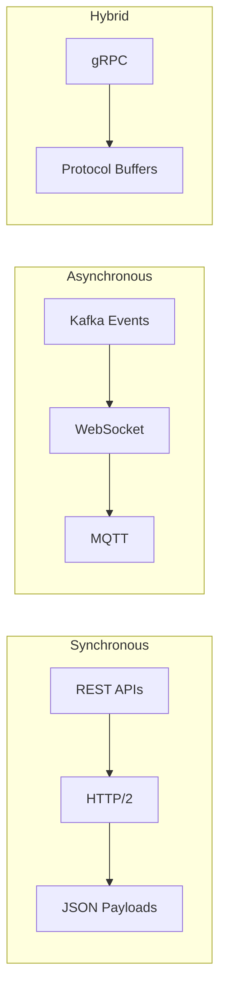

## 7.4 Cross-Cutting Concerns

### 7.4.1 Monitoring and Observability

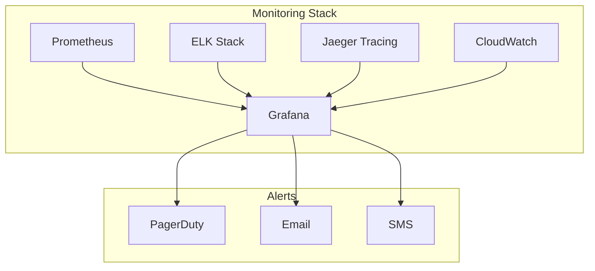

### 7.4.2 Deployment Architecture

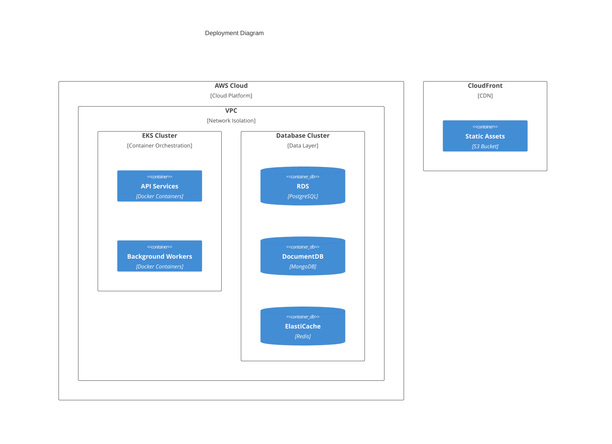

### 7.4.3 Security Architecture

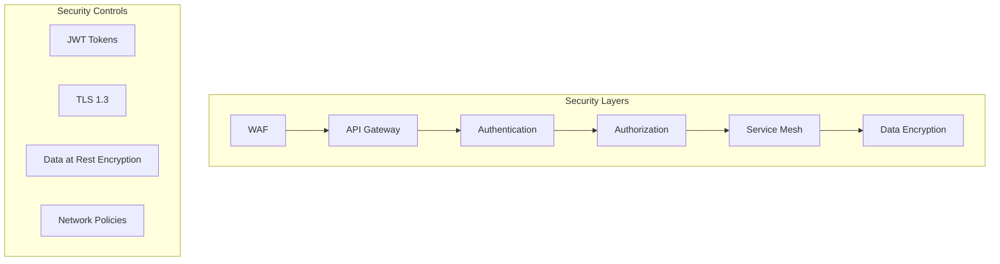

# 8. SYSTEM DESIGN

## 8.1 User Interface Design

### 8.1.1 Design Specifications

| Category | Requirements |
|---|---|
| Visual Hierarchy | - Primary actions use prominent colors and positioning<br>- Critical information displayed in top 30% of screen<br>- Maximum 3 levels of information hierarchy |
| Design System | - Material Design 3 for Android<br>- iOS Human Interface Guidelines for iOS<br>- Custom component library for cross-platform consistency |
| Responsive Design | - Support for screen sizes: 320px to 428px width<br>- Dynamic type scaling: 12px to 24px<br>- Flexible layouts with constraint-based design |
| Accessibility | - WCAG 2.1 Level AA compliance<br>- Minimum contrast ratio: 4.5:1<br>- Touch targets: 44x44pt minimum<br>- VoiceOver/TalkBack support |
| Platform Support | - iOS 13+ (iPhone 6S and newer)<br>- Android 8.0+ (API level 26+)<br>- Portrait and landscape orientation |
| Theming | - System-based dark/light mode switching<br>- Consistent color palette across modes<br>- Automatic contrast adjustment |
| Internationalization | - RTL layout support<br>- Dynamic text container sizing<br>- Date/time/currency localization<br>- Initial languages: English, Spanish |

### 8.1.2 Interface Elements

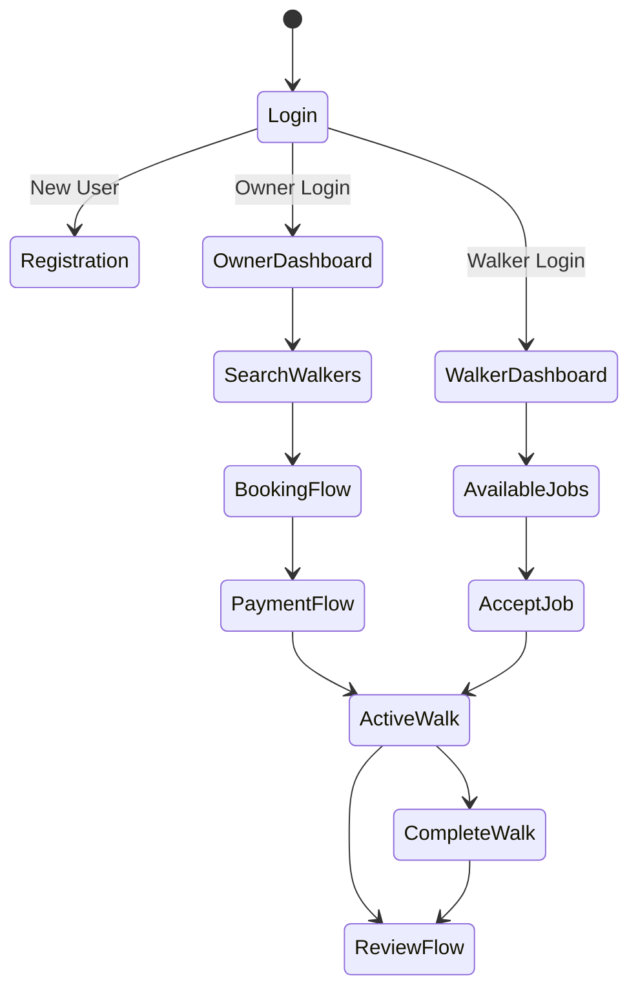

### 8.1.3 Critical User Flows

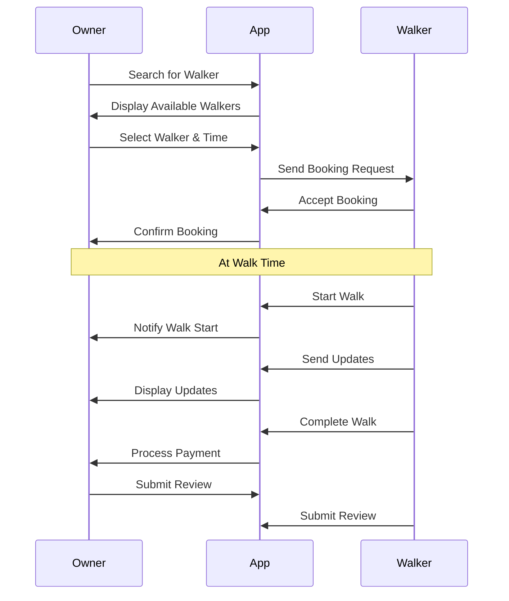

## 8.2 Database Design

### 8.2.1 Schema Design

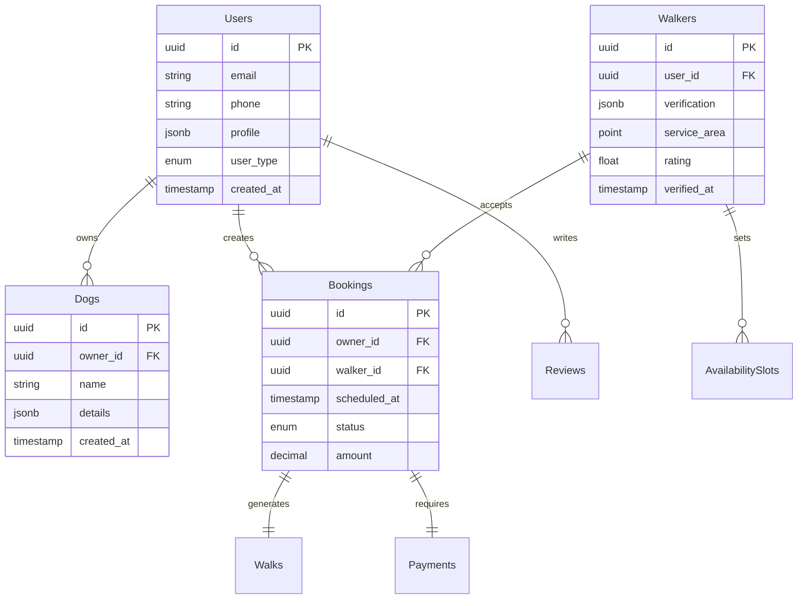

### 8.2.2 Data Management Strategy

| Aspect | Implementation |
|---|---|
| Partitioning | - Time-based partitioning for walks and bookings<br>- Geographic partitioning for walker data<br>- Hash partitioning for user data |
| Indexing | - B-tree indexes on lookup fields<br>- GiST indexes for geographic queries<br>- Partial indexes for active records |
| Caching | - Redis for session data (TTL: 24h)<br>- Application-level cache for static data<br>- Query-level cache for complex joins |
| Backup | - Full daily backups<br>- Incremental 6-hour backups<br>- 30-day retention period<br>- Cross-region replication |

## 8.3 API Design

### 8.3.1 API Architecture

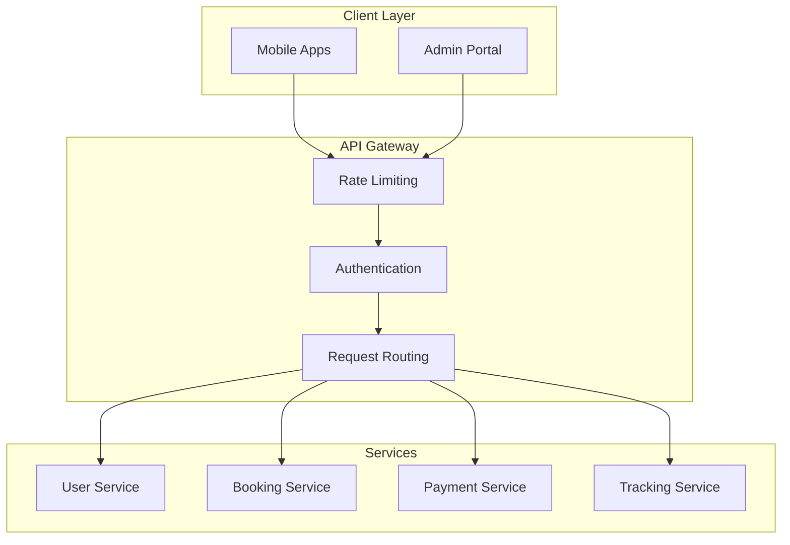

### 8.3.2 API Specifications

| Category | Requirements |
|---|---|
| Protocol | - REST over HTTPS<br>- WebSocket for real-time features |
| Authentication | - JWT with 1-hour expiry<br>- Refresh token rotation<br>- OAuth2 for social login |
| Rate Limiting | - 100 requests/minute per user<br>- 1000 requests/minute per walker<br>- Custom limits for premium users |
| Versioning | - URI versioning (v1, v2)<br>- Backward compatibility guarantee<br>- Deprecation notices 90 days ahead |
| Documentation | - OpenAPI 3.0 specification<br>- Interactive documentation<br>- Code samples in multiple languages |

### 8.3.3 Integration Patterns

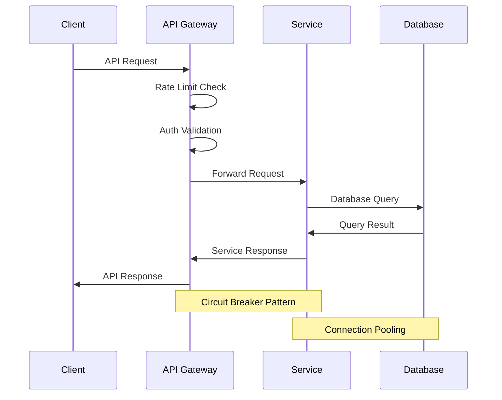

# 9. TECHNOLOGY STACK

## 9.1 PROGRAMMING LANGUAGES

| Platform/Component | Language | Version | Justification |
|---|---|---|---|
| iOS Application | Swift | 5.9+ | - Native performance and UX<br>- Direct access to iOS location services<br>- Strong type safety<br>- Modern concurrency support |
| Android Application | Kotlin | 1.9+ | - Official Android development language<br>- Java interoperability<br>- Coroutines for async operations<br>- Reduced boilerplate code |
| Backend Services | Go | 1.21+ | - High performance for real-time services<br>- Excellent concurrency model<br>- Low memory footprint<br>- Strong standard library |
| Supporting Services | Node.js | 20 LTS | - Large ecosystem for integrations<br>- Efficient for I/O operations<br>- Async processing capabilities<br>- Easy maintenance |

## 9.2 FRAMEWORKS & LIBRARIES

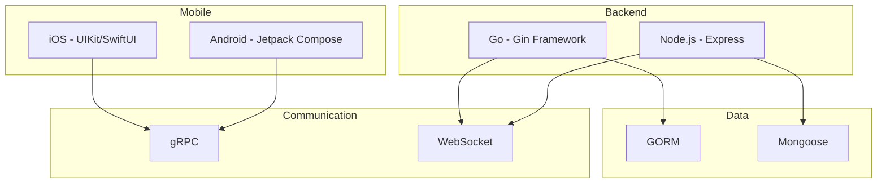

### Core Frameworks

| Component | Framework | Version | Purpose |
|---|---|---|---|
| iOS | UIKit/SwiftUI | iOS 13+ | Primary UI framework with modern declarative syntax |
| Android | Jetpack Compose | 1.5+ | Modern UI toolkit for native Android development |
| Backend (Go) | Gin | 1.9+ | High-performance HTTP web framework |
| Backend (Node.js) | Express | 4.18+ | Flexible web application framework |
| ORM (Go) | GORM | 1.25+ | Database operations and migrations |
| ODM (Node.js) | Mongoose | 7.5+ | MongoDB object modeling |

### Supporting Libraries

| Category | Library | Version | Purpose |
|---|---|---|---|
| Maps (iOS) | MapKit | Latest | Native iOS mapping and location services |
| Maps (Android) | Google Maps SDK | 18.2+ | Android mapping and location tracking |
| Real-time | Socket.IO | 4.7+ | Real-time communication framework |
| Payment | Stripe SDK | Latest | Payment processing integration |
| Analytics | Firebase Analytics | Latest | User behavior tracking |
| Testing | XCTest/JUnit | Latest | Unit and integration testing |

## 9.3 DATABASES & STORAGE

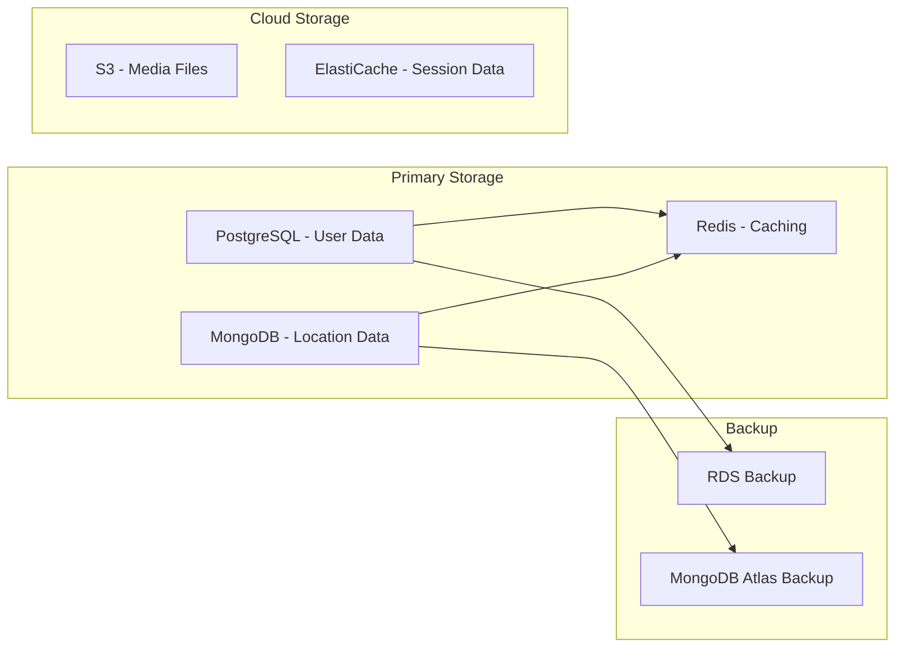

| Type | Technology | Version | Purpose |
|---|---|---|---|
| Primary Database | PostgreSQL | 15+ | User profiles, bookings, transactions |
| Document Store | MongoDB | 6.0+ | Location data, walk routes, analytics |
| Cache Layer | Redis | 7.0+ | Session management, real-time data |
| Object Storage | AWS S3 | Latest | Media files, documents |
| Search Engine | Elasticsearch | 8.0+ | Location-based search |

## 9.4 THIRD-PARTY SERVICES

| Category | Service | Purpose | Integration Method |
|---|---|---|---|
| Payment Processing | Stripe | Financial transactions | REST API |
| Maps & Location | Google Maps | Geocoding, routing | SDK |
| Push Notifications | Firebase Cloud Messaging | User notifications | SDK |
| Authentication | Auth0 | User authentication | OAuth 2.0 |
| Background Checks | Checkr | Walker verification | REST API |
| Analytics | Mixpanel | User behavior analysis | SDK |
| Monitoring | Datadog | Application monitoring | Agent-based |

## 9.5 DEVELOPMENT & DEPLOYMENT

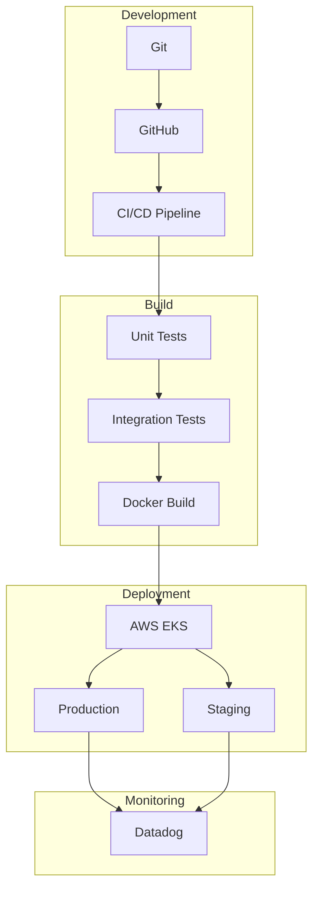

### Development Tools

| Category | Tool | Version | Purpose |
|---|---|---|---|
| Version Control | Git | Latest | Source code management |
| IDE (iOS) | Xcode | 15+ | iOS development |
| IDE (Android) | Android Studio | 2023.1+ | Android development |
| IDE (Backend) | GoLand/VS Code | Latest | Backend development |
| API Testing | Postman | Latest | API development and testing |

### Build & Deployment

| Component | Technology | Version | Purpose |
|---|---|---|---|
| Containerization | Docker | 24+ | Application containerization |
| Container Orchestration | Kubernetes | 1.27+ | Container management |
| CI/CD | GitHub Actions | Latest | Automated pipeline |
| Infrastructure | Terraform | 1.5+ | Infrastructure as code |
| Registry | Amazon ECR | Latest | Container registry |
| Secrets Management | AWS Secrets Manager | Latest | Configuration management |

Based on the background information and previous sections, I'll generate the SYSTEM DESIGN section focusing on UI, database, and API design since this is a mobile application with client-server architecture. I'll maintain consistency with the technology choices already specified.

## 8.1 User Interface Design

### 8.1.1 Design Specifications

| Category | Requirements |
|---|---|---|
| Visual Hierarchy | - Primary actions use prominent colors and positioning<br>- Critical information displayed in top 30% of screen<br>- Maximum 3 levels of information hierarchy |
| Design System | - Material Design 3 for Android<br>- iOS Human Interface Guidelines for iOS<br>- Custom component library for cross-platform consistency |
| Responsive Design | - Support for screen sizes: 320px to 428px width<br>- Dynamic type scaling: 12px to 24px<br>- Flexible layouts with constraint-based design |
| Accessibility | - WCAG 2.1 Level AA compliance<br>- Minimum contrast ratio: 4.5:1<br>- Touch targets: 44x44pt minimum<br>- VoiceOver/TalkBack support |
| Platform Support | - iOS 13+ (iPhone 6S and newer)<br>- Android 8.0+ (API level 26+)<br>- Portrait and landscape orientation |
| Theming | - System-based dark/light mode switching<br>- Consistent color palette across modes<br>- Automatic contrast adjustment |
| Internationalization | - RTL layout support<br>- Dynamic text container sizing<br>- Date/time/currency localization<br>- Initial languages: English, Spanish |

### 8.1.2 Interface Elements


### 8.1.3 Critical User Flows


## 8.2 Database Design

### 8.2.1 Schema Design


### 8.2.2 Data Management Strategy

| Aspect | Implementation |
|---|---|---|
| Partitioning | - Time-based partitioning for walks and bookings<br>- Geographic partitioning for walker data<br>- Hash partitioning for user data |
| Indexing | - B-tree indexes on lookup fields<br>- GiST indexes for geographic queries<br>- Partial indexes for active records |
| Caching | - Redis for session data (TTL: 24h)<br>- Application-level cache for static data<br>- Query-level cache for complex joins |
| Backup | - Full daily backups<br>- Incremental 6-hour backups<br>- 30-day retention period<br>- Cross-region replication |

## 8.3 API Design

### 8.3.1 API Architecture


### 8.3.2 API Specifications

| Category | Requirements |
|---|---|---|
| Protocol | - REST over HTTPS<br>- WebSocket for real-time features |
| Authentication | - JWT with 1-hour expiry<br>- Refresh token rotation<br>- OAuth2 for social login |
| Rate Limiting | - 100 requests/minute per user<br>- 1000 requests/minute per walker<br>- Custom limits for premium users |
| Versioning | - URI versioning (v1, v2)<br>- Backward compatibility guarantee<br>- Deprecation notices 90 days ahead |
| Documentation | - OpenAPI 3.0 specification<br>- Interactive documentation<br>- Code samples in multiple languages |

### 8.3.3 Integration Patterns


Based on the provided documentation and requirements, I'll create the User Interface Design section focusing on the key mobile app screens for both dog owners and walkers.

# 8. SYSTEM DESIGN

## 8.1 User Interface Design

### 8.1.1 Design Specifications

| Category | Requirements |
|---|---|---|
| Visual Hierarchy | - Primary actions use prominent colors and positioning<br>- Critical information displayed in top 30% of screen<br>- Maximum 3 levels of information hierarchy |
| Design System | - Material Design 3 for Android<br>- iOS Human Interface Guidelines for iOS<br>- Custom component library for cross-platform consistency |
| Responsive Design | - Support for screen sizes: 320px to 428px width<br>- Dynamic type scaling: 12px to 24px<br>- Flexible layouts with constraint-based design |
| Accessibility | - WCAG 2.1 Level AA compliance<br>- Minimum contrast ratio: 4.5:1<br>- Touch targets: 44x44pt minimum<br>- VoiceOver/TalkBack support |
| Platform Support | - iOS 13+ (iPhone 6S and newer)<br>- Android 8.0+ (API level 26+)<br>- Portrait and landscape orientation |
| Theming | - System-based dark/light mode switching<br>- Consistent color palette across modes<br>- Automatic contrast adjustment |
| Internationalization | - RTL layout support<br>- Dynamic text container sizing<br>- Date/time/currency localization<br>- Initial languages: English, Spanish |

### 8.1.2 Interface Elements

```
Key:
[?] Help/Info     [$] Payments    [i] Information  [+] Add/Create
[x] Close/Delete  [<] [>] Nav     [^] Upload       [#] Menu
[@] Profile       [!] Alert       [=] Settings     [*] Favorite
[ ] Checkbox      ( ) Radio       [...] Text       [v] Dropdown
```

```
+----------------------------------------+
|           Dog Owner Dashboard           |
|[@] John Smith                      [=]  |
+----------------------------------------+
| [?] Find a Walker                       |
| [...............................] [>]   |
|                                        |
|    Current Location:                   |
|    [i] 123 Main St, City              |
|                                        |
| Active Walks:                          |
| +----------------------------------+   |
| | [!] Walk in Progress             |   |
| | Walker: Sarah J.                 |   |
| | Time: 2:30 PM - 3:30 PM         |   |
| | [Track Walk]                     |   |
| +----------------------------------+   |
|                                        |
| Quick Actions:                         |
| [Book Walk] [$] Payment Methods        |
|                                        |
| [#] Recent Walks                       |
| +-- Max - Yesterday with Sarah J.      |
| +-- Bella - 3 days ago with John D.    |
+----------------------------------------+
```

```
+----------------------------------------+
|           Walker Dashboard              |
|[@] Sarah Johnson                   [=]  |
+----------------------------------------+
| Status: ( ) Available  (*) Busy         |
|                                        |
| Current Earnings: [$] $125.50          |
|                                        |
| Upcoming Walks:                        |
| +----------------------------------+   |
| | [!] Next Walk in 30min           |   |
| | Owner: John S.                   |   |
| | Dogs: Max (Golden Retriever)     |   |
| | Time: 2:30 PM - 3:30 PM         |   |
| | [Start Walk] [Cancel]            |   |
| +----------------------------------+   |
|                                        |
| Available Jobs:                        |
| +-- 3:00 PM - Lucy (Poodle)      [>]  |
| +-- 4:30 PM - Bear (Husky)       [>]  |
|                                        |
| Weekly Schedule:                       |
| [v] This Week                         |
| [============================] 80%     |
+----------------------------------------+
```

```
+----------------------------------------+
|           Active Walk Screen            |
|[<] Back                           [!]  |
+----------------------------------------+
|                                        |
|    +------------------------------+    |
|    |                              |    |
|    |        [MAP VIEW]            |    |
|    |     Current Location         |    |
|    |        Route Path            |    |
|    |                              |    |
|    +------------------------------+    |
|                                        |
| Walk Details:                          |
| Time Elapsed: 00:15:23                 |
| Distance: 0.8 miles                    |
|                                        |
| Actions:                               |
| [^] Add Photo    [i] Report Issue      |
|                                        |
| Dog Status:                            |
| [ ] Pee Break                          |
| [ ] Water Break                        |
| [ ] Rest Stop                          |
|                                        |
| [End Walk]                             |
+----------------------------------------+
```

### 8.1.3 Critical User Flows

```mermaid
sequenceDiagram
    participant O as Owner
    participant A as App
    participant W as Walker
    
    O->>A: Search for Walker
    A->>O: Display Available Walkers
    O->>A: Select Walker & Time
    A->>W: Send Booking Request
    W->>A: Accept Booking
    A->>O: Confirm Booking
    
    Note over O,W: At Walk Time
    W->>A: Start Walk
    A->>O: Notify Walk Start
    W->>A: Send Updates
    A->>O: Display Updates
    W->>A: Complete Walk
    A->>O: Process Payment
    
    O->>A: Submit Review
    W->>A: Submit Review
```

# 10. SECURITY CONSIDERATIONS

## 10.1 Authentication and Authorization

### 10.1.1 Authentication Methods

| User Type | Primary Authentication | Secondary Authentication | Session Management |
|---|---|---|---|
| Dog Owners | Email/Password or Social OAuth | SMS/Email Verification | JWT with 1-hour expiry |
| Dog Walkers | Email/Password | Mandatory 2FA (SMS/Authenticator) | JWT with 30-minute expiry |
| Admin Users | SSO with Azure AD | Hardware Security Key | JWT with 15-minute expiry |

### 10.1.2 Authorization Matrix

```mermaid
graph TD
    A[User Roles] --> B[Dog Owner]
    A --> C[Dog Walker]
    A --> D[Admin]
    
    B --> E[Owner Permissions]
    C --> F[Walker Permissions]
    D --> G[Admin Permissions]
    
    E --> H[View/Book Walks]
    E --> I[Manage Dogs]
    E --> J[Payment Methods]
    
    F --> K[Accept/Decline Walks]
    F --> L[Track Location]
    F --> M[Earnings Access]
    
    G --> N[User Management]
    G --> O[System Config]
    G --> P[Analytics]
```

### 10.1.3 Role-Based Access Control

| Role | Access Level | Permissions |
|---|---|---|
| Dog Owner | Basic | - Create/modify own profile<br>- Manage dog profiles<br>- Book/cancel walks<br>- View walker profiles<br>- Access payment history |
| Dog Walker | Enhanced | - Manage walker profile<br>- Accept/decline walks<br>- Access earnings<br>- Upload walk photos<br>- View assigned owner profiles |
| Admin | Full | - User management<br>- System configuration<br>- Analytics access<br>- Support tools<br>- Financial operations |

## 10.2 Data Security

### 10.2.1 Data Classification

| Data Type | Classification | Storage Requirements | Encryption Level |
|---|---|---|---|
| User Credentials | Critical | Encrypted at rest | AES-256 |
| Payment Information | Critical | PCI DSS compliant | AES-256 |
| Location Data | Sensitive | Encrypted, time-limited | AES-256 |
| Profile Information | Sensitive | Encrypted at rest | AES-256 |
| Walk History | Internal | Standard encryption | AES-128 |
| App Analytics | Public | No special encryption | None |

### 10.2.2 Encryption Framework

```mermaid
flowchart LR
    A[Data Input] --> B[TLS 1.3]
    B --> C[API Gateway]
    C --> D[Application Layer]
    D --> E[Data Processing]
    E --> F[Storage Layer]
    
    subgraph Encryption At Rest
        F --> G[AES-256]
        G --> H[Encrypted Storage]
    end
    
    subgraph Key Management
        I[AWS KMS] --> G
        I --> B
    end
```

### 10.2.3 Data Protection Measures

| Protection Layer | Implementation | Purpose |
|---|---|---|
| Transport Security | TLS 1.3 | Secure data in transit |
| Storage Security | AES-256 encryption | Protect data at rest |
| Key Management | AWS KMS | Secure key storage and rotation |
| Access Control | RBAC + ABAC | Granular access management |
| Data Masking | Dynamic masking | Protect sensitive data in logs |

## 10.3 Security Protocols

### 10.3.1 Security Standards Compliance

| Standard | Scope | Implementation |
|---|---|---|
| OWASP Mobile Top 10 | Mobile app security | Secure coding practices and testing |
| PCI DSS | Payment processing | Compliant payment gateway integration |
| GDPR | Data privacy | User consent and data protection measures |
| SOC 2 | System security | Regular audits and compliance monitoring |

### 10.3.2 Security Monitoring

```mermaid
graph TB
    subgraph Detection
        A[WAF] --> B[SIEM]
        C[IDS/IPS] --> B
        D[Log Analysis] --> B
    end
    
    subgraph Response
        B --> E[Alert System]
        E --> F[Security Team]
        F --> G[Incident Response]
    end
    
    subgraph Prevention
        H[Regular Audits]
        I[Penetration Testing]
        J[Vulnerability Scanning]
    end
```

### 10.3.3 Security Procedures

| Procedure | Frequency | Description |
|---|---|---|
| Security Audits | Quarterly | Comprehensive system security review |
| Penetration Testing | Semi-annual | External security assessment |
| Vulnerability Scanning | Weekly | Automated security scanning |
| Code Security Review | Per release | Manual and automated code analysis |
| Access Review | Monthly | User access and permission audit |
| Key Rotation | 90 days | Cryptographic key rotation |
| Security Training | Quarterly | Team security awareness training |

### 10.3.4 Incident Response

```mermaid
stateDiagram-v2
    [*] --> Detection
    Detection --> Analysis
    Analysis --> Containment
    Containment --> Eradication
    Eradication --> Recovery
    Recovery --> PostIncident
    PostIncident --> [*]
    
    Analysis --> Escalation: If Critical
    Escalation --> Containment
```

# 11. INFRASTRUCTURE

## 11.1 DEPLOYMENT ENVIRONMENT

```mermaid
flowchart TB
    subgraph Production Environment
        A[AWS Cloud] --> B[Multi-Region Deployment]
        B --> C[US East]
        B --> D[US West]
        B --> E[EU Central]
        
        subgraph Region Components
            C --> F[Availability Zones]
            F --> G[VPC]
            G --> H[Public Subnets]
            G --> I[Private Subnets]
        end
    end
```

| Environment | Purpose | Configuration |
|---|---|---|
| Development | Local development and testing | - Local Kubernetes cluster<br>- Minikube for container orchestration<br>- Local database instances |
| Staging | Pre-production testing | - Single region AWS deployment<br>- Scaled-down infrastructure<br>- Production data subset |
| Production | Live application environment | - Multi-region deployment<br>- Full high-availability setup<br>- Auto-scaling enabled |
| DR Environment | Disaster recovery | - Hot standby in alternate region<br>- Automated failover capability<br>- Regular DR testing |

## 11.2 CLOUD SERVICES

### Primary AWS Services

| Service | Purpose | Configuration |
|---|---|---|
| EKS | Container orchestration | - Managed Kubernetes<br>- Multi-AZ deployment<br>- Auto-scaling node groups |
| RDS | Relational database | - PostgreSQL 15+<br>- Multi-AZ deployment<br>- Read replicas |
| DocumentDB | Document database | - MongoDB compatible<br>- 3-node cluster<br>- Auto-scaling storage |
| ElastiCache | Caching layer | - Redis 7.0+<br>- Cluster mode enabled<br>- Multi-AZ replication |
| S3 | Object storage | - Standard storage class<br>- Versioning enabled<br>- Cross-region replication |
| CloudFront | CDN | - Global edge locations<br>- HTTPS enforcement<br>- Custom domain support |

### Supporting Services

```mermaid
graph LR
    subgraph Security
        A[WAF] --> B[Shield]
        B --> C[KMS]
    end
    
    subgraph Monitoring
        D[CloudWatch] --> E[X-Ray]
        E --> F[CloudTrail]
    end
    
    subgraph Networking
        G[Route53] --> H[API Gateway]
        H --> I[VPC]
    end
```

## 11.3 CONTAINERIZATION

### Docker Configuration

| Component | Base Image | Purpose |
|---|---|---|
| API Services | golang:1.21-alpine | Backend API containers |
| Workers | node:20-alpine | Background job processors |
| Frontend | node:20-alpine | Static asset building |
| Migrations | golang:1.21-alpine | Database migration jobs |

### Container Architecture

```mermaid
graph TB
    subgraph Application Containers
        A[API Gateway] --> B[User Service]
        A --> C[Booking Service]
        A --> D[Payment Service]
        A --> E[Tracking Service]
    end
    
    subgraph Support Containers
        F[Migration Job]
        G[Backup Job]
        H[Monitoring Agent]
    end
```

## 11.4 ORCHESTRATION

### Kubernetes Configuration

| Resource Type | Purpose | Specifications |
|---|---|---|
| Deployments | Application workloads | - Rolling updates<br>- Auto-scaling<br>- Health checks |
| StatefulSets | Stateful services | - Ordered pod management<br>- Persistent storage<br>- Stable network identifiers |
| Services | Internal networking | - Load balancing<br>- Service discovery<br>- External access |
| ConfigMaps | Configuration | - Environment variables<br>- Application config<br>- Feature flags |
| Secrets | Sensitive data | - Credentials<br>- API keys<br>- Certificates |

### Cluster Architecture

```mermaid
graph TB
    subgraph EKS Cluster
        A[Ingress Controller] --> B[Service Mesh]
        B --> C[Application Pods]
        B --> D[Worker Pods]
        
        subgraph Node Groups
            E[System Nodes]
            F[Application Nodes]
            G[Worker Nodes]
        end
    end
```

## 11.5 CI/CD PIPELINE

### Pipeline Stages

```mermaid
flowchart LR
    A[Code Push] --> B[Build]
    B --> C[Test]
    C --> D[Security Scan]
    D --> E[Package]
    E --> F[Deploy to Staging]
    F --> G[Integration Tests]
    G --> H[Deploy to Production]
    H --> I[Post-Deploy Tests]
```

### Pipeline Configuration

| Stage | Tools | Actions |
|---|---|---|
| Source Control | GitHub | - Branch protection<br>- Pull request reviews<br>- Automated linting |
| Build | GitHub Actions | - Docker image building<br>- Unit tests<br>- Code coverage |
| Security | Snyk, SonarQube | - Dependency scanning<br>- Code quality checks<br>- SAST analysis |
| Deployment | ArgoCD | - GitOps workflow<br>- Automated rollbacks<br>- Deployment strategies |
| Monitoring | Datadog | - Performance monitoring<br>- Error tracking<br>- Deployment markers |

### Deployment Strategy

```mermaid
graph TB
    subgraph Production Deployment
        A[Blue Environment] 
        B[Green Environment]
        C[Load Balancer]
        
        C --> A
        C --> B
    end
    
    subgraph Deployment Process
        D[Health Check]
        E[Traffic Shift]
        F[Verification]
        G[Rollback Option]
    end
```

# APPENDICES

## A.1 Additional Technical Information

### A.1.1 Background Check Integration Flow

```mermaid
sequenceDiagram
    participant W as Walker
    participant A as App
    participant C as Checkr API
    participant S as Storage
    
    W->>A: Submit verification request
    A->>C: Initialize background check
    C->>A: Return check ID
    A->>W: Request documents
    W->>A: Upload documents
    A->>S: Store documents
    A->>C: Submit documents
    C->>A: Process check (async)
    Note over C,A: 2-5 business days
    C->>A: Return results
    A->>W: Notify completion
```

### A.1.2 Emergency Response Protocol

| Stage | Action | Responsible Party | SLA |
|---|---|---|---|
| Detection | Emergency button pressed or geofence breach | System | Immediate |
| Notification | Alert support team and owner | System | < 30 seconds |
| Assessment | Evaluate situation severity | Support Team | < 2 minutes |
| Response | Contact emergency services if needed | Support Team | < 3 minutes |
| Follow-up | Document incident and contact parties | Support Team | < 24 hours |

## A.2 Glossary

| Term | Definition |
|---|---|---|
| Active Walk | A dog walking session currently in progress with real-time tracking enabled |
| Availability Window | Time slots when a walker is available to accept booking requests |
| Booking Window | Minimum 1-hour notice required for scheduling a walk |
| Emergency Contact | Designated person to be contacted in case of incidents during walks |
| Geofence Breach | When a walker moves outside the predetermined walking area boundary |
| Service Area | Geographic region where a walker offers their services (max 25-mile radius) |
| Surge Pricing | Dynamic pricing model during high-demand periods |
| Verification Badge | Visual indicator showing a walker has passed all background checks |
| Walk Credits | Prepaid walking sessions that can be purchased in bulk |
| Walker Rating | Aggregate score based on owner reviews (1-5 scale) |

## A.3 Acronyms

| Acronym | Full Form | Context |
|---|---|---|
| ABAC | Attribute-Based Access Control | Security framework |
| APNs | Apple Push Notification service | iOS notifications |
| CDN | Content Delivery Network | Static asset delivery |
| CQRS | Command Query Responsibility Segregation | Architecture pattern |
| FCM | Firebase Cloud Messaging | Push notifications |
| HIPAA | Health Insurance Portability and Accountability Act | Data privacy |
| MTBF | Mean Time Between Failures | Reliability metric |
| MTTR | Mean Time To Recovery | System recovery |
| SAST | Static Application Security Testing | Security scanning |
| SLA | Service Level Agreement | Performance metrics |
| SSO | Single Sign-On | Authentication |
| TTL | Time To Live | Cache management |
| VPC | Virtual Private Cloud | Network isolation |
| WAF | Web Application Firewall | Security |
| WebRTC | Web Real-Time Communication | Real-time data |

## A.4 API Response Codes

| Code | Description | Example Scenario |
|---|---|---|
| 200 | Success | Successful booking creation |
| 201 | Created | New user registration |
| 400 | Bad Request | Invalid booking parameters |
| 401 | Unauthorized | Invalid authentication token |
| 403 | Forbidden | Unverified walker access attempt |
| 404 | Not Found | Invalid walker ID |
| 409 | Conflict | Double booking attempt |
| 429 | Too Many Requests | Rate limit exceeded |
| 500 | Internal Server Error | Database connection failure |
| 503 | Service Unavailable | Scheduled maintenance |

## A.5 Error Handling Codes

```mermaid
graph TD
    A[Error Detection] --> B{Error Type}
    B -->|User| C[4xx Client Errors]
    B -->|System| D[5xx Server Errors]
    B -->|Network| E[Network Errors]
    
    C --> F[Input Validation]
    C --> G[Authentication]
    C --> H[Authorization]
    
    D --> I[Database Errors]
    D --> J[Service Errors]
    D --> K[Integration Errors]
    
    E --> L[Timeout]
    E --> M[Connection Lost]
    E --> N[DNS Issues]
```